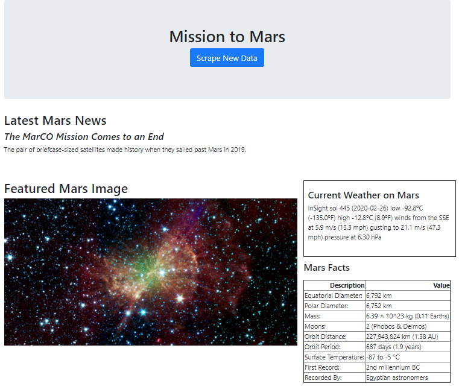
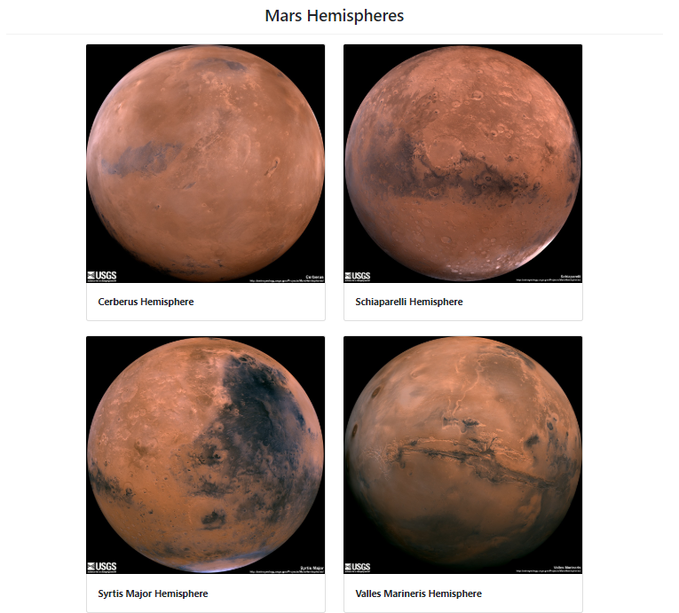

# web-scraping-challenge
# Mission to Mars

## Step 1 - Scraping
Jupyter Notebook: mission_to_mars.ipynb

## Step 2 - MongoDB and Flask Application
Scrape file: scrape_mars.py
Flask file: app.py
HTML file: templates/index.html

## Screenshots

